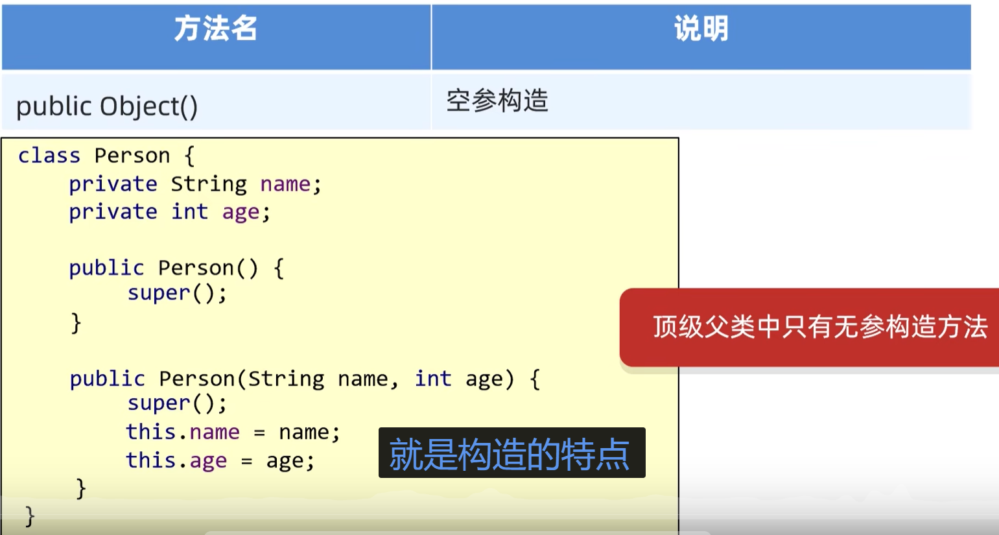
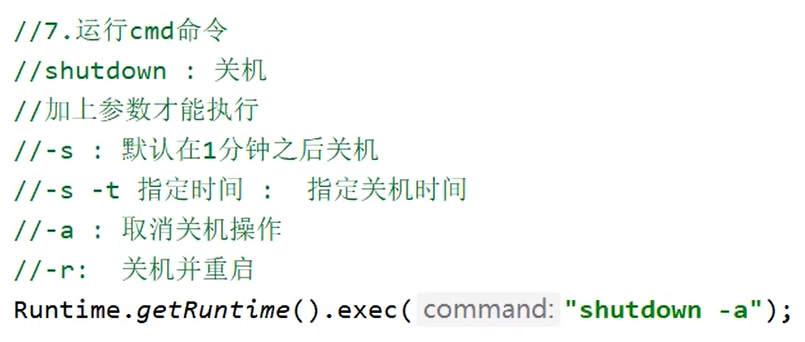

### 1. 静态方法调用

#### 1. 两种调用方式

1. 通过类名来调用（常用）。类名必须是静态方法所属类的类名
2. 先创建类的对象，再通过对象调用。这个对象也必须是静态方法所属类的对象

#### 2. 调用规则？

1. 静态方法属于类本身，所以在**同一个类内部**，可以**直接写方法名**来调用，不需要对象，也不需要类名前缀；如果在不同类，就需要通过类名调用或者创建类的对象来调用
2. 静态方法不依赖对象，执行时可能没有任何对象存在，因此**静态方法中不能用 this**
3. 如果在静态方法里调用非静态方法 / 属性，必须**手动创建对象**，如 `new FileDemo03().methd()`，而不是用 `this.method()`

#### 3. 对比实例方法调用

1. 在**同一个类的实例方法内部**，调用该类其他实例方法时，其实是隐式地用 `this`（当前对象）调用，不需要手动创建新对象
2. **同类静态方法**调用实例方法，必须new对象
3. **其他类**调用实例方法，必须new对象

### 2. 变量调用

1. 方法内变量，局部变量，只能本方法用
2. 类中方法外变量，全局变量，此类能用，别类也能用（在别类中new 这个类的对象，再调用）

### 3. 执行语句

1. 成员区域只能写 “声明 / 定义” 代码，不能写 “执行逻辑” 代码
2. 如`list.add(...)`属于执行动作，必须放在**方法、构造方法或代码块**里，直接写在类里会报错。

有如下几种方式等等：

1. 用「构造方法」初始化

   ```java
   public class LoginJFrame extends JFrame implements MouseListener {
   
       // 1. 成员区域：只做声明（合法）
       ArrayList<User> list = new ArrayList<>();
       User u1 = new User("张三", "zhangsan123!");
       User u2 = new User("李四", "lisi123!");
   
       // 2. 构造方法：写执行逻辑（初始化数据）
       public LoginJFrame() {
           // 这里调用 add 方法完全合法
           list.add(u1);
           list.add(u2);
           
           // 你的窗口初始化代码（如设置大小、布局、添加组件）也放这里
           initFrame();
       }
   
       // 其他方法（如鼠标监听、登录校验）可以直接使用 list
   }
   ```

   2. 用「静态代码块」初始化（适合全局共享的固定数据）

      ```java
      public class LoginJFrame extends JFrame implements MouseListener {
      
          // 1. 声明为静态成员（全局共享）
          static ArrayList<User> list = new ArrayList<>();
      
          // 2. 静态代码块：类加载时自动执行，初始化数据
          static {
              User u1 = new User("张三", "zhangsan123!");
              User u2 = new User("李四", "lisi123!");
              list.add(u1);
              list.add(u2);
          }
      
          // 其他方法直接调用 list 即可
      }
      ```

### 4. 构造方法

1. 私有化构造方法，让外界无法创建它的对象

2. object构造方法，无参构造

   

### 5. java Runtime类使用

1. 用法

   

### 6. 继承

1. 当父类的方法无法继续满足需要，就在子类中重写。如toString()

### 7. 接口

1. 某方法的参数是一个接口，所以在调用此方法时，需要传递这个接口的实现类对象。而这个实现类只需要只用一次的话，就没有必要单独写一个类，直接采用**匿名内部类**的方式

   


### 8. 目录分隔符

1. Windows文件资源管理器会自动为 **反斜杠** \
2. Java写入路径分隔符 由于转义字符\以及反斜杠 所以为 **双反斜杠** \\
3. **正斜杠** / 才是各种兼容