# 单列集合

# 1. List

有序、可重复、有索引

## 1. ArrayList

## 2. LinkedList

## 3. Vector

# 2. Set

无序：存取顺序不一致

不重复：可以去除重复

无索引：不能用普通for

## 1. TreeSet

### 树

### 1. 二叉查找树

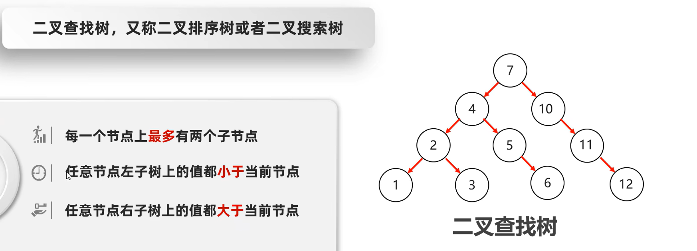

添加数据：小的存左边，大的存右边

### 2. 平衡二叉树

任意节点的左右子树高度不超过1

二叉树 -> 二叉查找树 -> 平衡二叉树

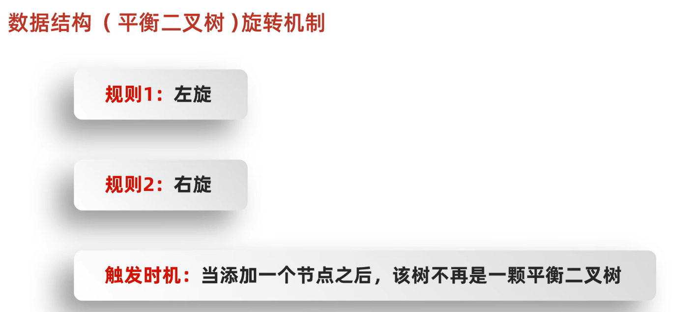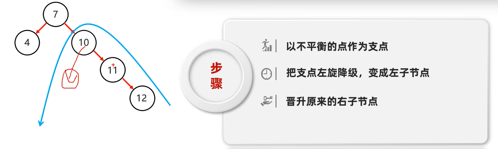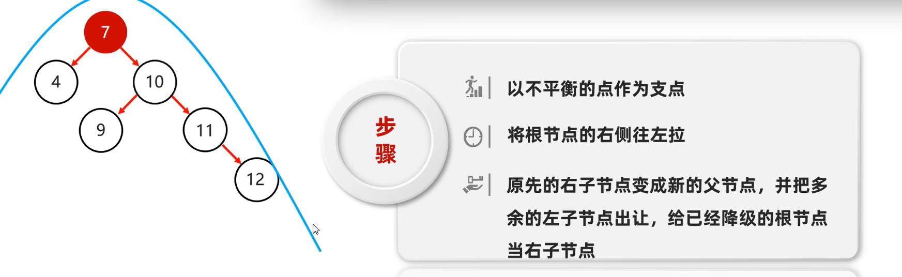

### 3. 红黑树

又称平衡二叉B树。是一种特殊的二叉查找树。

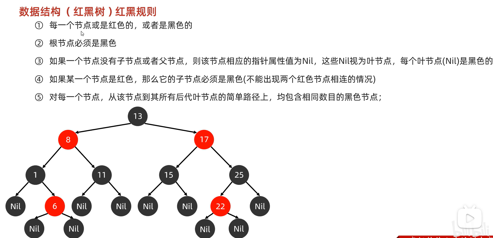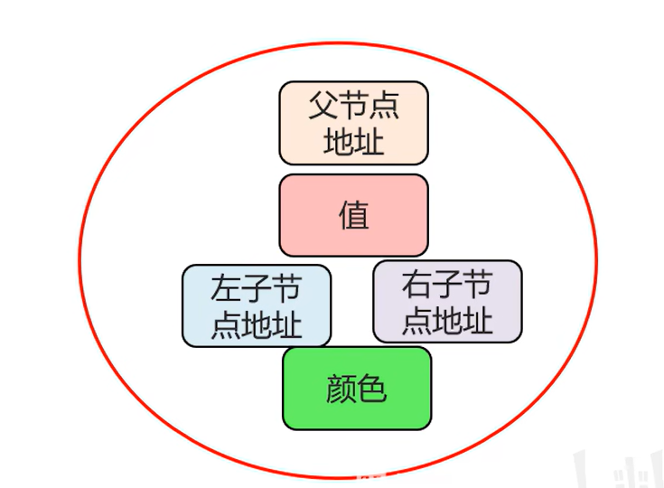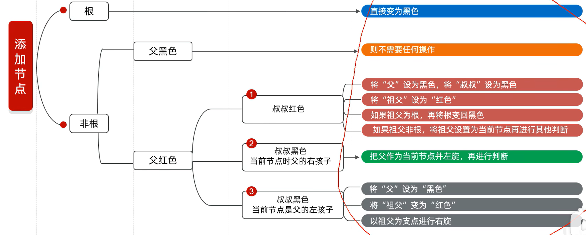

### TreeSet

底层为红黑树

可排序

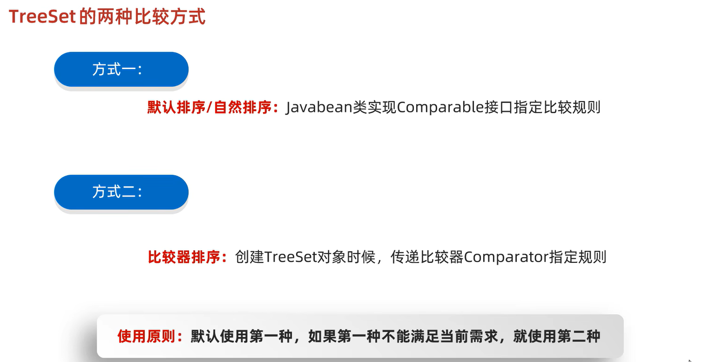

## 2. HashSet

哈希值：对象的整数表现形式

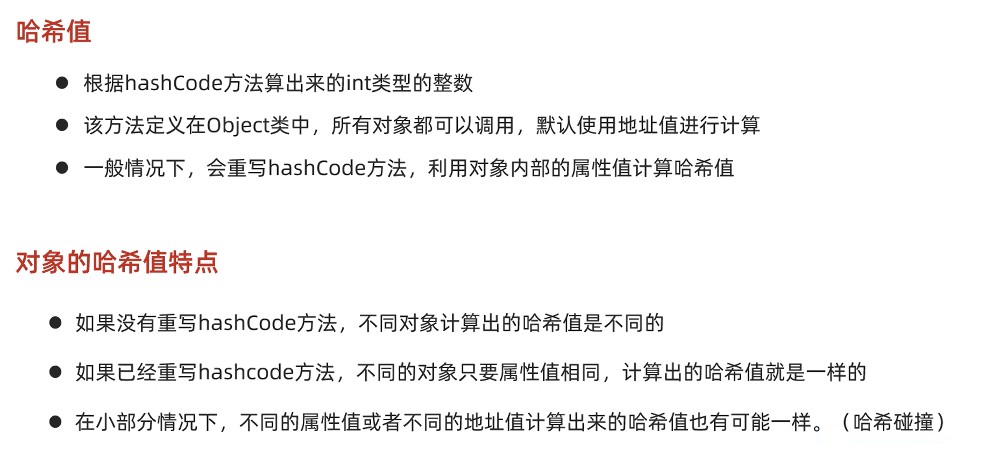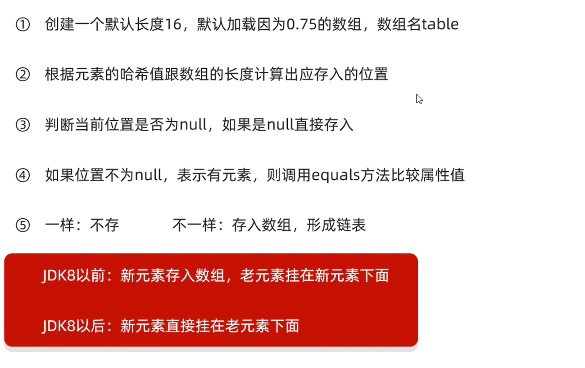

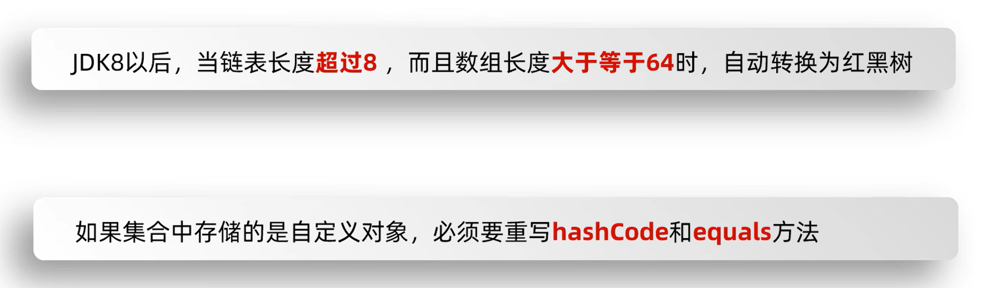

## 3. LinkedHashSet

双向链表确保有序

## 4. 使用场景

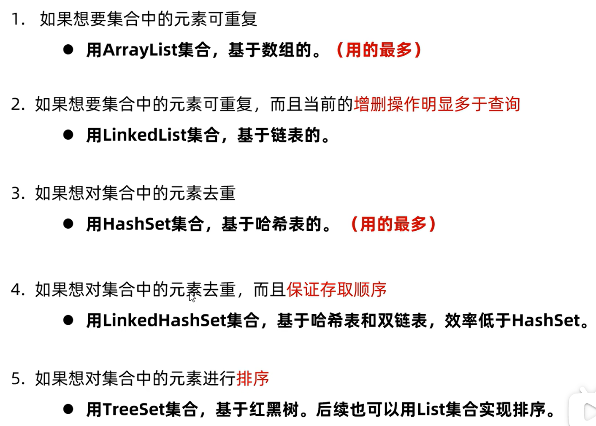

# 双列集合

## 1. Map

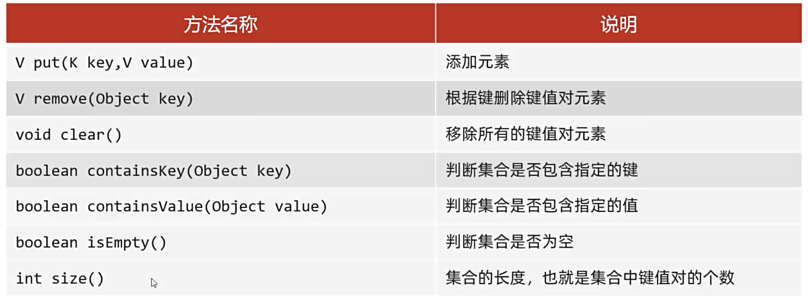

## 2. HashMap

## 3. TreeMap

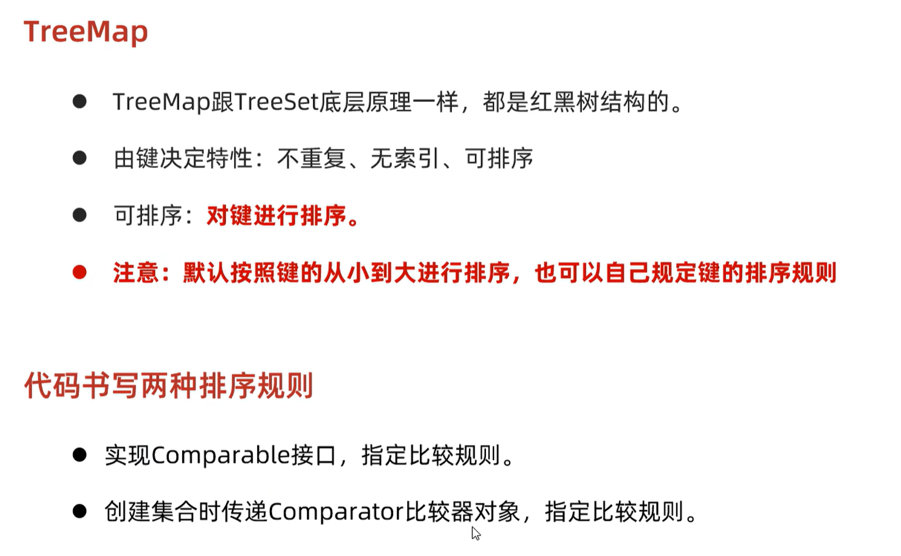

## 4. LinkedHashMap

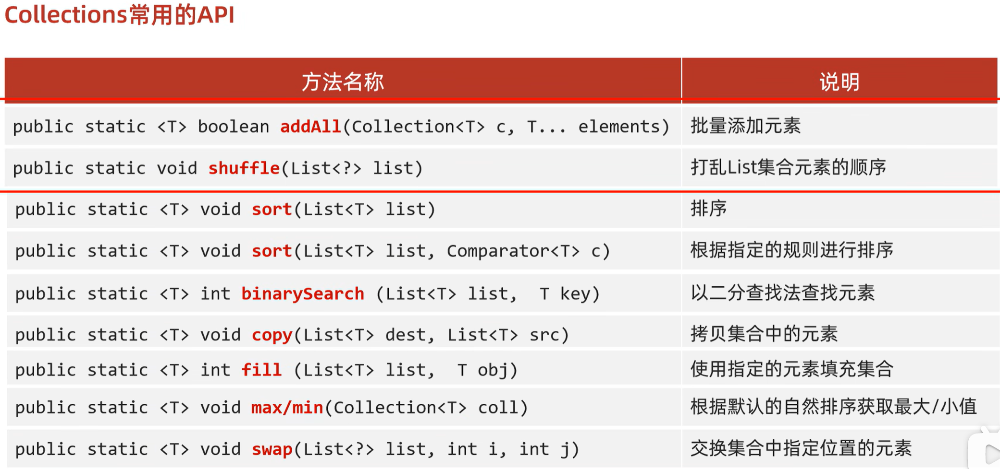
