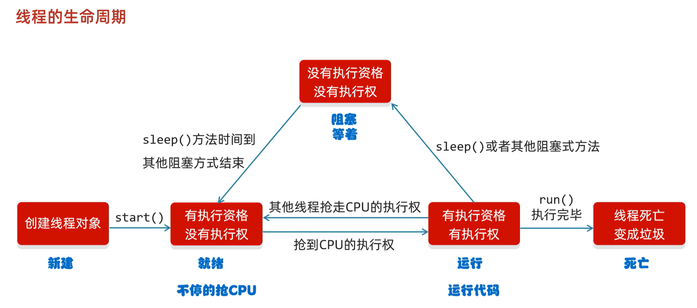
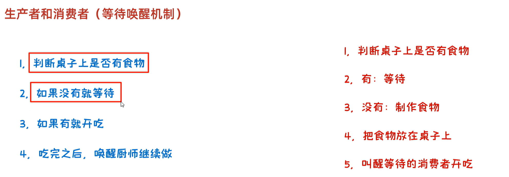
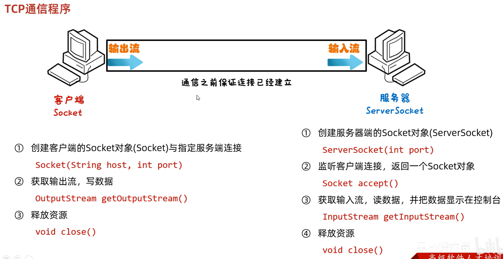
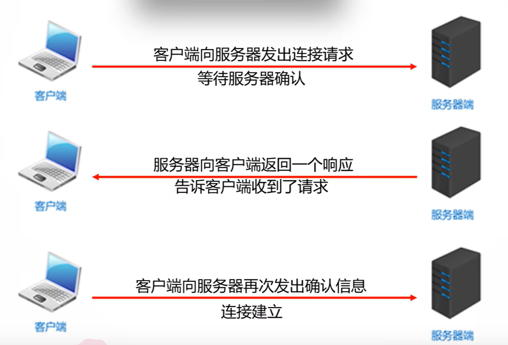
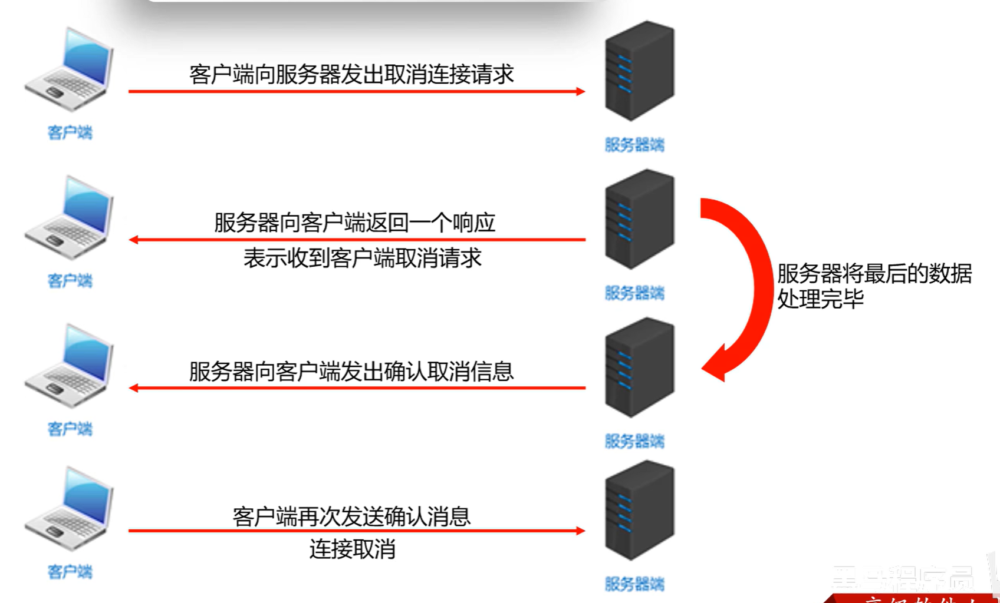
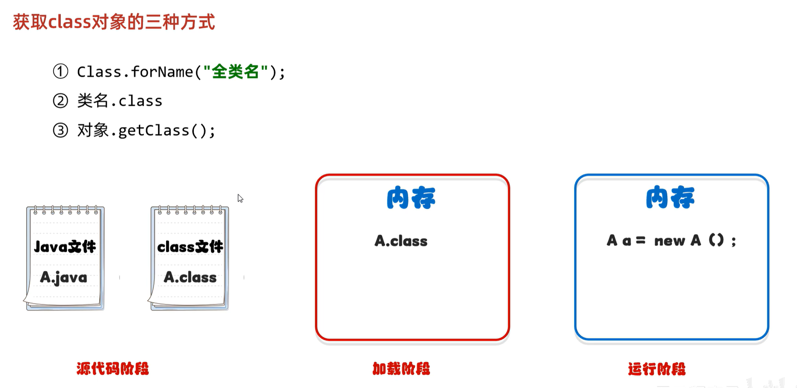

## 1. 多线程

1. 并发：在同一时刻，有多个指令在**单个CPU上交替**执行
2. 并行：在同一时刻，有多个指令在**多个CPU上同时**执行

### 1. 多线程的实现方式

1. 继承Thread类

   定义一个类继承Thread

   重写run方法

   创建子类对象，并启动线程

2. 实现Runnable接口

   定义一个类实现Runnable接口

   重写run方法

   创建自己类的对象

   创建Thread类的对象，并开启线程

3. 利用Callable接口和Future接口实现，可以获取到多线程运行的结果

   创建一个myCallable类实现callable接口

   重写call（返回值，表示多线程运行的结果）

   创建mycallable的对象，表示多线程要执行的任务

   创建futuretask的对象，管理多线程运行的结果

   创建Thread类的对象，并启动，表示线程

### 2. 成员方法

### 3. 线程的生命周期

### 4. 生产者和消费者（等待唤醒机制）

## 2. 网络编程

### 网络编程三要素

### 1. IP

Internet Protocol 设备在网络中的地址，是唯一的标识

1. IPv4：Internet Protocol version4 互联网通信协议第四版。

   32位地址长度->点分十进制表示法。2019.11.26全部分配完毕

   127.0.0.1 localhost 本地回环地址

   `ipconfig`: 查看本机IP地址

   `ping`: 检查网络是否连通

2. IPv6：128位地址长度->冒分十六进制

### 2. 端口号

应用程序在设备中唯一的标识。一个端口号只能被一个应用程序使用。

两个字节表示的整数 0 ~ 65535

0 ~ 1023之间的端口号用于一些知名的网络服务或应用

### 3. 协议

数据在网络传输中的规则，常见的协议有UDP、TCP、HTTP、HTTPS、FTP

1. **UDP协议：**

   **用户数据报协议 User Datagram Protocol**

   **面向无连接通信协议**

   **速度快，有大小限制一次最多发送64k，数据不安全，易丢失数据**

2. **TCP协议：**

   **传输控制协议 Transmission Control Protocol**

   **面向连接的通信协议**

   **速度慢，没有大小限制，数据安全**

### UDP三种通信方式

### 1. 单播

### 2. 组播

224.0.0.0 - 224.0.0.255

### 3. 广播

255.255.255.255

### TCP通信

### 1. 三次握手

### 2. 四次挥手

## 3. 反射

反射允许对成员变量、成员方法和构造方法的信息进行编程访问。

