## 1. Stream流

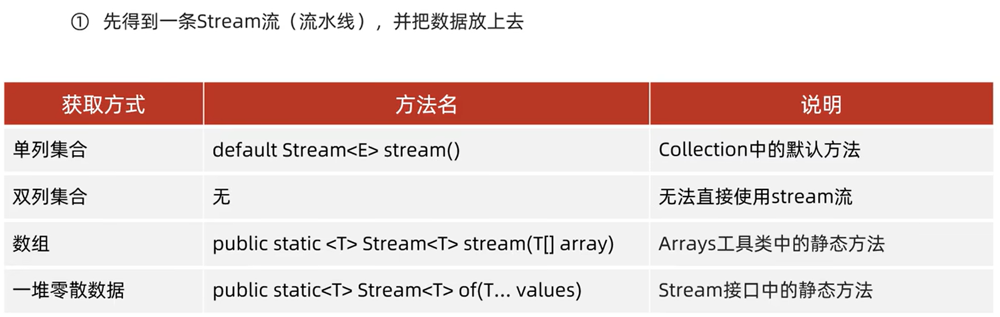

1. 中间方法

   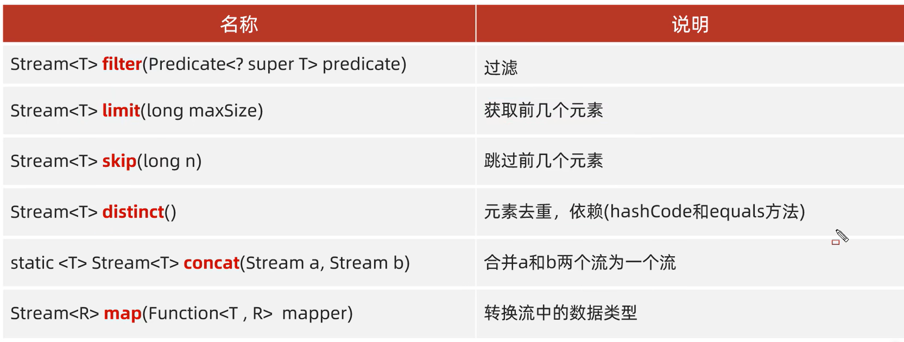

2. 终结方法

   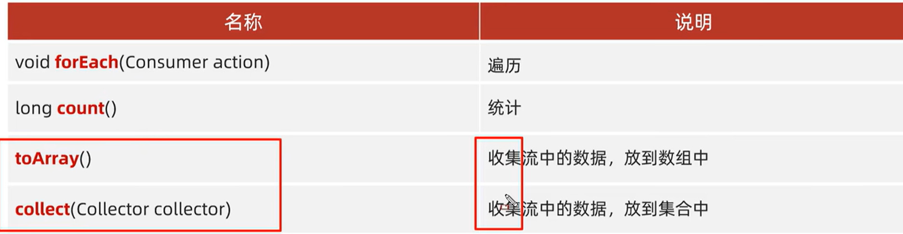

## 2. 方法引用

把已经有的方法拿过来用，当作函数式接口中抽象方法的方法体

引用处必须是函数式接口<br>被引用的方法必须已经存在<br>被引用方法的形参和返回值需要跟抽象方法保持一致<br>被引用方法的功能要满足当前需求

### 1. 引用静态方法

### 2. 引用成员方法

1. 其他类
2. 本类
3. 父类

### 3. 引用构造方法

### 4. 其他调用方式

1. 使用类名引用成员方法

   引用处必须是函数式接口<br>被引用的方法必须已经存在<br>被引用方法的形参，需要跟抽象方法的第二个形参到最后一个形参保持一致，返回值需要保持一致

   被引用方法的功能需要满足当前的需求。如图：

   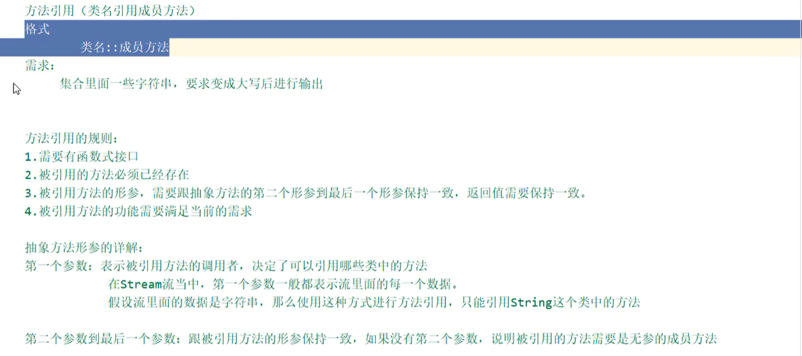

2. 引用数组的构造方法

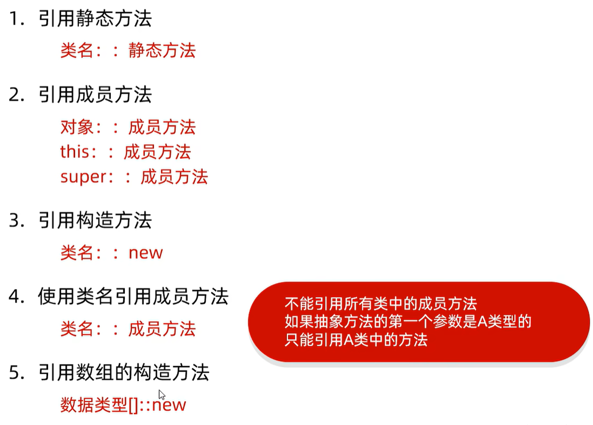

实例：

```java
// 使用完整的匿名内部类
// 先通过map()将字符串变成Student对象，再通过toArray()将Student放入数组
Student[] array = list.stream()
                .map(new Function<String, Student>() {
                    @Override
                    public Student apply(String s) {

                        String name = s.split("-")[0];
                        int age = Integer.parseInt(s.split("-")[1]);

                        return new Student(name, age);
                    }
                })
                .toArray(new IntFunction<Student[]>() {
                    @Override
                    public Student[] apply(int value) {
                        return new Student[value];
                    }
                });
```

```java
// 方法引用
// 引用Student类中的构造方法，将流中的数据变成Student对象
// 创建一个Student类型的数组，并把流中的数据放进数组
Student[] array1 = list.stream()
    .map(Student::new)
    .toArray(Student[]::new);
```

```java
// 被引用的Student类中的构造方法
public Student(String s) {

        this.name = s.split("-")[0];
        this.age = Integer.parseInt(s.split("-")[1]);

    }
```

虽然我感觉还是不懂。。。

**有疑问有疑问：第一种和第二种的区别在哪？有忌讳吗？**

**我靠等等，刚刚发现竟然还有 -> 类名：：成员方法**

```java
public class FunctionDemo05{
    psvma{
        ArrayList<Student> list = new ArrayList<>();
        list.add(new Student("zhangsan", 23));
        list.add(new Student("lisi", 24));
        list.add(new Student("wangwu", 25));
        
        // 第一种：像这样静态方法引用。即类名::静态方法
        String[] array1 = list.stream().map(FunctionDemo05::getName).toArray(String[]::new);
        
        // 第二种: 实例方法引用。即对象::成员方法
        String[] array1 = list.stream().map(new FunctionDemo05()::getName).toArray(String[]::new);
    }
    
    // 让方法成为静态的，满足条件
    public static getname(Student s){
        return s.getName();
    }
    
    // 让方法不是静态
    public static getname(Student s){
        return s.getName();
    }
}
```

## 3. 异常

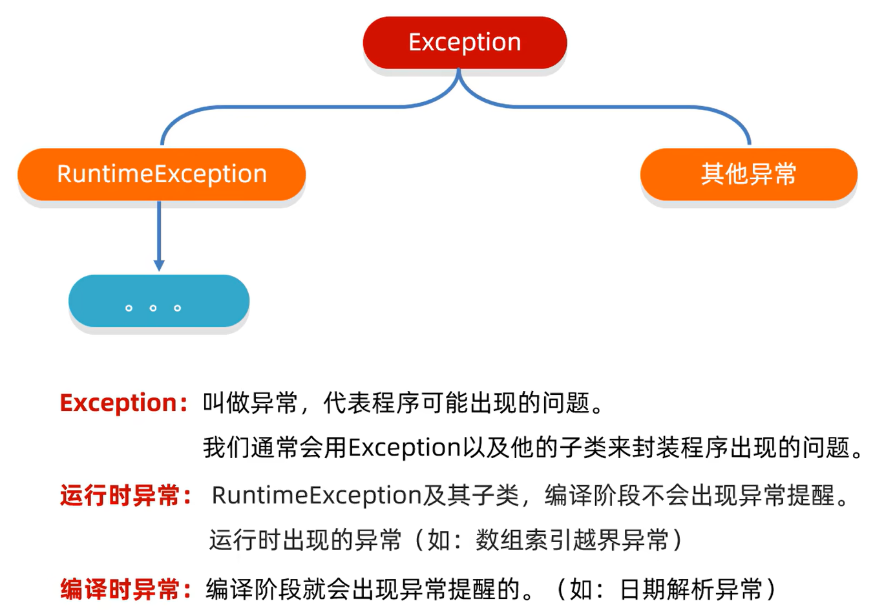

1. 分类：     	运行时异常 RuntimeException及其子类：由于参数错误

   ​			编译时异常：提醒程序员检查本地信息

2. 作用1：查询bug的关键参考信息

   作用2：作为方法内部的一种特殊返回值，一边通知调用者底层的执行情况

### 1. 异常处理方式

1. jvm虚拟机默认处理方案：异常的名称、原因及异常出现的位置等信息输出在了控制台，且程序停止执行

2. 捕获异常：好处：程序继续往下执行，不会停止

   ```java
   try{
       可能出现异常的代码;
   }catch(异常类名 变量名){
       异常的处理代码;
   }
   ```

   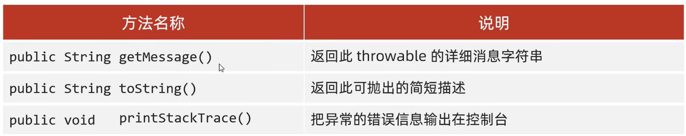

3. 抛出异常

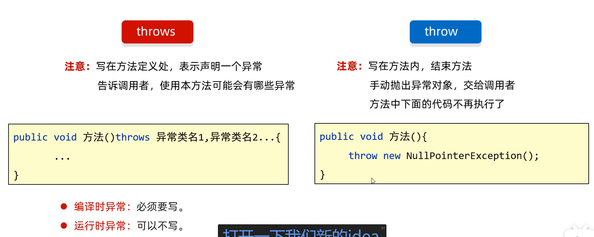

## 4. file

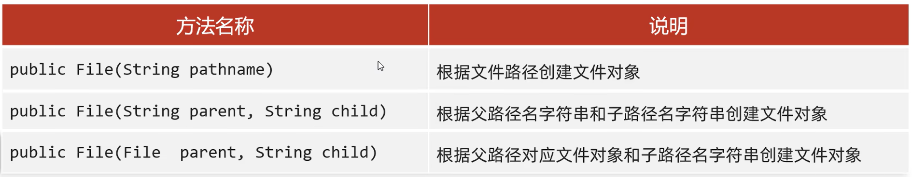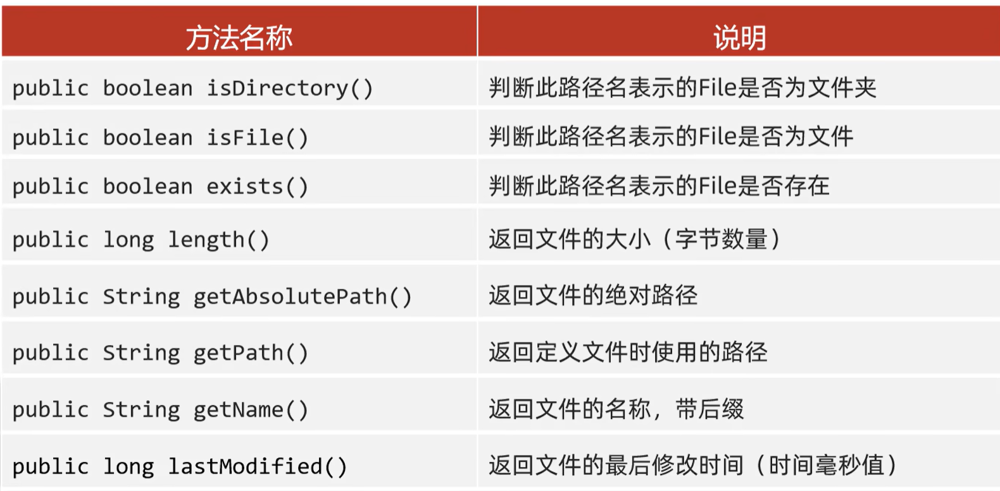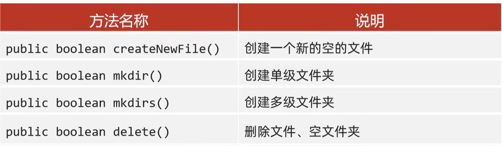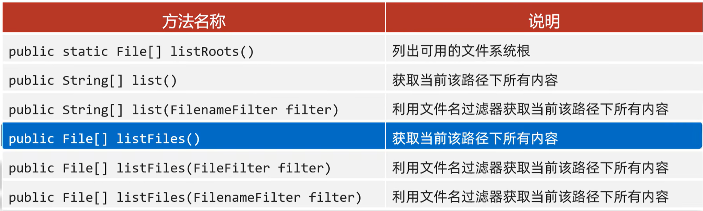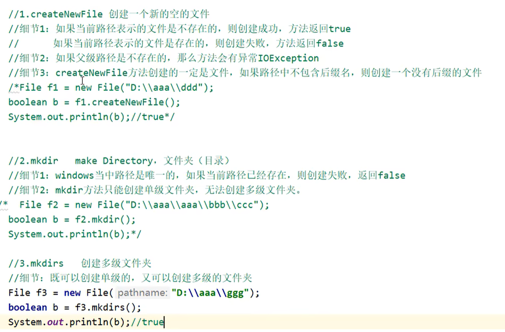

listfile()方法：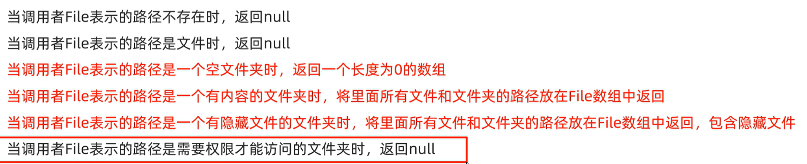

## 5. IO流

### 1. FileOutputStream细节

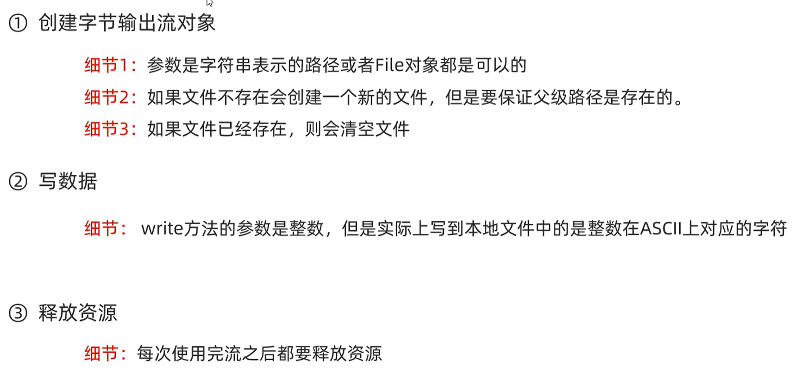

### 2. 字符集

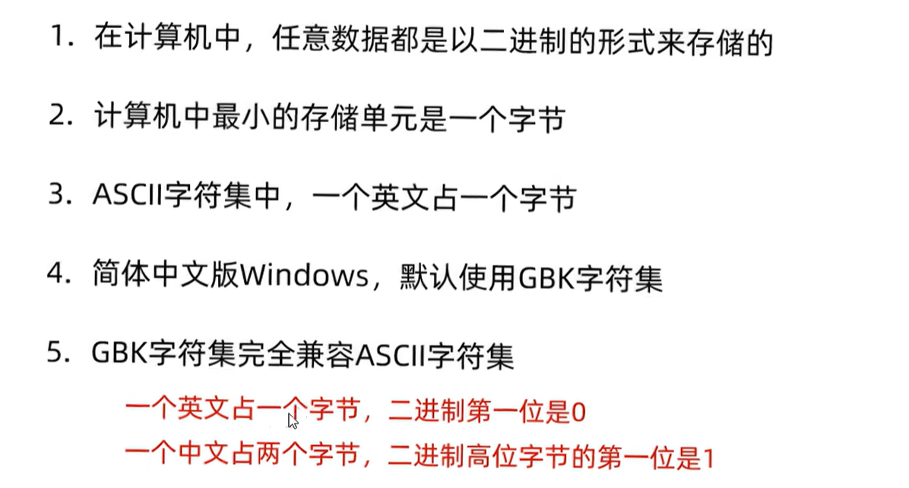

unicode: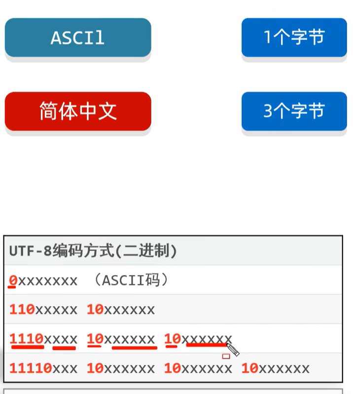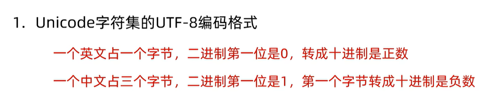

例如：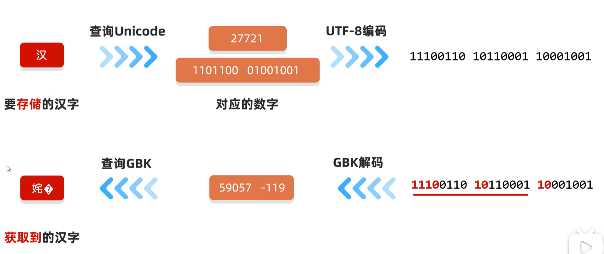

### 3. 字符流

字符输出流：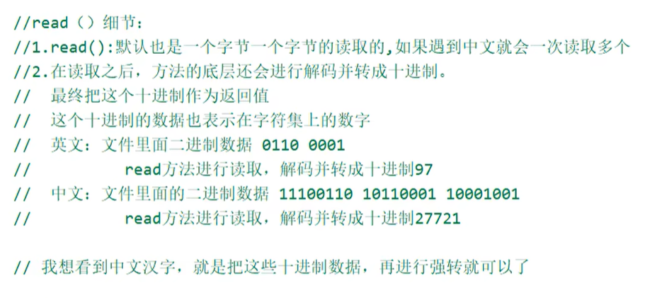

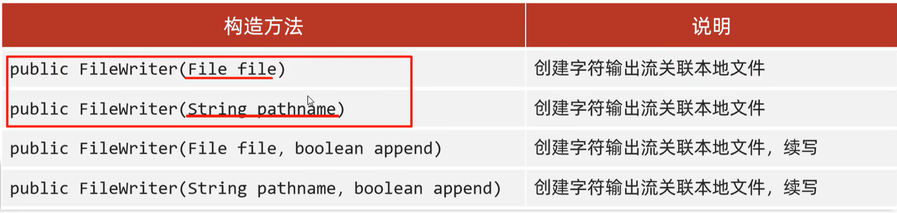

字节流没有缓冲区，字符流有缓冲区

### 4. 序列化流
